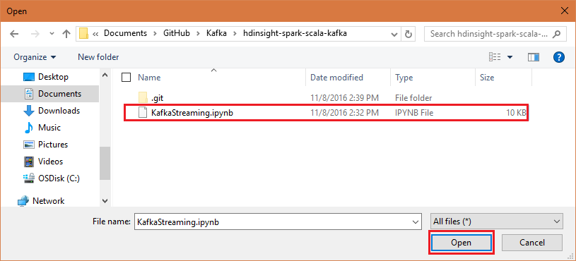
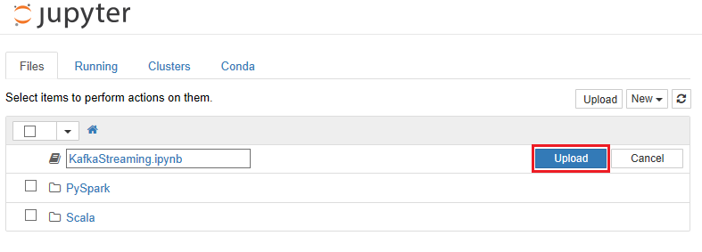

# Use Apache Kafka with Apache Spark on hdinsight

This is a basic example of streaming data to and from Kafka on HDInsight from a Spark on HDInsight cluster.

__NOTE__: Apache Kafka and Spark are available as two different cluster types. HDInsight cluster types are tuned for the performance of a specific technology; in this case, Kafka and Spark. To use both together, you must create an Azure Virtual network and then create both a Kafka and Spark cluster on the virtual network. For an example of how to do this using an Azure Resource Manager template, see [https://hditutorialdata.blob.core.windows.net/armtemplates/create-linux-based-kafka-spark-cluster-in-vnet.json](https://hditutorialdata.blob.core.windows.net/armtemplates/create-linux-based-kafka-spark-cluster-in-vnet.json). For an example of using the template with this example, see [Use Apache Spark with Kafka on HDInsight (preview)](https://docs.microsoft.com/azure/hdinsight/hdinsight-apache-spark-with-kafka).

## Understand this example

This example uses a Scala application in a Jupyter notebook. The code in the notebook relies on the following pieces of data:

* __Kafka brokers__: The broker process runs on each workernode on the Kafka cluster. The list of brokers is required by the producer component, which writes data to Kafka.

* __Zookeeper hosts__: The Zookeeper hosts for the Kafka cluster are used when consuming (reading) data from Kafka.

* __Topic name__: The name of the topic that data is written to and read from. This example expects a topic named `sparktest`.

See the [Kafka host information](#kafkahosts) section for information on how to obtain the Kafka broker and Zookeeper host information.

The code in the notebook performs the following tasks:

* Creates a consumer that reads data from a Kafka topic named `sparktest`, counts each word in the data, and stores the word and count into a temporary table named `wordcounts`.

* Creates a producer that writes random sentences to the Kafka topic named `sparktest`.

* Selects data from the `wordcounts` table to display the counts.

Each cell in the project contains comments or a text section that explains what the code does.

## Get Kafka information

From your development environment, use the following commands to retrieve the broker and Zookeeper information. Replace __PASSWORD__ with the login (admin) password you used when creating the cluster. Replace __BASENAME__ with the base name you used when creating the cluster.

* To get the __Kafka broker__ information:

        curl -u admin:PASSWORD -G "https://kafka-BASENAME.azurehdinsight.net/api/v1/clusters/kafka-BASENAME/services/KAFKA/components/KAFKA_BROKER" | jq -r '["\(.host_components[].HostRoles.host_name):9092"] | join(",")'

    When using this command from Windows PowerShell, you may receive an error about shell quoting. If so, use the following command:
    
        curl -u admin:PASSWORD -G "https://kafka-BASENAME.azurehdinsight.net/api/v1/clusters/kafka-BASENAME/services/KAFKA/components/KAFKA_BROKER" | jq -r '["""\(.host_components[].HostRoles.host_name):9092"""] | join(""",""")

* To get the __Zookeeper host__ information:

        curl -u admin:PASSWORD -G "https://kafka-BASENAME.azurehdinsight.net/api/v1/clusters/kafka-BASENAME/services/ZOOKEEPER/components/ZOOKEEPER_SERVER" | jq -r '["\(.host_components[].HostRoles.host_name):2181"] | join(",")'
    
    When using this command from Windows PowerShell, you may receive an error about shell quoting. If so, use the following command:
    
        curl -u admin:PASSWORD -G "https://kafka-BASENAME.azurehdinsight.net/api/v1/clusters/kafka-BASENAME/services/ZOOKEEPER/components/ZOOKEEPER_SERVER" | jq -r '["""\(.host_components[].HostRoles.host_name):2181"""] | join(""",""")'

Both commands return information similar to the following text:

* __Kafka brokers__: `wn0-kafka.4rf4ncirvydube02fuj0gpxp4e.ex.internal.cloudapp.net:9092,wn1-kafka.4rf4ncirvydube02fuj0gpxp4e.ex.internal.cloudapp.net:9092`

* __Zookeeper hosts__: `zk0-kafka.4rf4ncirvydube02fuj0gpxp4e.ex.internal.cloudapp.net:2181,zk1-kafka.4rf4ncirvydube02fuj0gpxp4e.ex.internal.cloudapp.net:2181,zk2-kafka.4rf4ncirvydube02fuj0gpxp4e.ex.internal.cloudapp.net:2181`

Save this information; you will need it when you use the notebook.

## Use the Jupyter notebook

To use the example Jupyter notebook, you must upload it to the Jupyter Notebook server on the Spark cluster. Use the following steps to upload the notebook:

1. In your web browser, use the following URL to connect to the Jupyter Notebook server on the Spark cluster. Replace __BASENAME__ with the base name used when you created the cluster.

        https://spark-BASENAME.azurehdinsight.net/jupyter

    When prompted, enter the cluster login (admin) and password used when you created the cluster.

2. From the upper right side of the page, use the __Upload__ button to upload the `KafkaStreaming.ipynb` file. Select the file in the file browser dialog and select __Open__. 

    

    

3. Find the __KafkaStreaming.ipynb__ entry in the list of notebooks, and select __Upload__ button beside it.

    

4. Once the file has uploaded, select the __KafkaStreaming.ipynb__ entry to open the notebook. To complete this example, follow the instructions in the notebook.